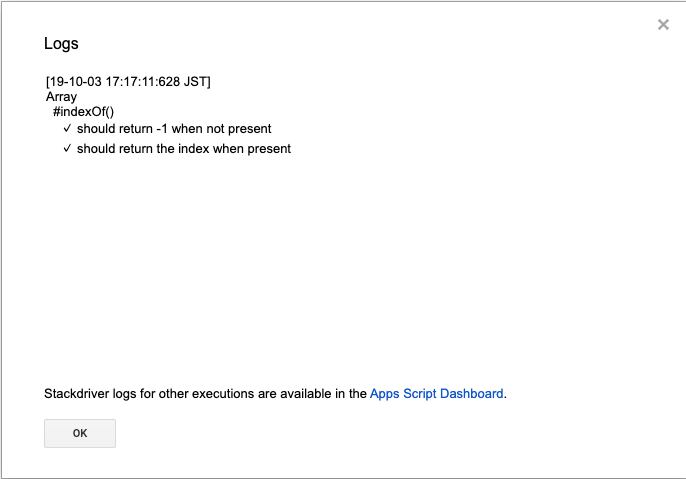
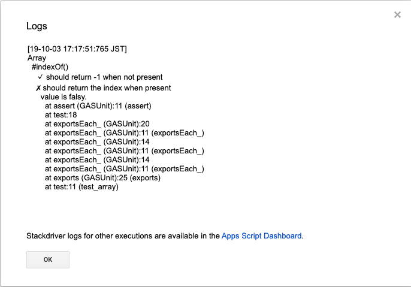
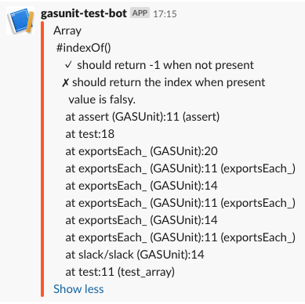

[](https://github.com/google/clasp)
[](https://github.com/piotrwitek/ts-mocha)
[](https://standardjs.com)

[English](README.md) - **日本語**

# GASUnit


Google Apps Script用のテストライブラリ。  
結果はロガーに記録されるか、Slackに投稿されます。

## 使い方
### ライブラリを追加
プロジェクトキー：`MSnMmw8hLWgjUG6uKSTQBEzVZgzu5bsVr`

### テストを書く
テストを書くために、 **Exports** スタイルを使用できます（今のところは）。

#### Exportsスタイル
Exportsスタイルは、[Mocha](https://mochajs.org/#exports)にインスパイアされています。

ロガーを使用：

```js
var exports = GASUnit.exports
var assert = GASUnit.assert

function test_array () {
  exports({
    'Array': {
      '#indexOf()': {
        'should return -1 when not present': function () {
          assert([1, 2, 3].indexOf(4) === -1)
        },
        'should return the index when present': function () {
          assert([1, 2, 3].indexOf(3) === 3)
        }
      }
    }
  })
}
```

Slackを使用：

```js
var WEBHOOK_URL = 'https://...'
var exports = GASUnit.slack(WEBHOOK_URL).exports
var assert = GASUnit.assert

function test_array () {
  exports({
    'Array': {
      '#indexOf()': {
        'should return -1 when not present': function () {
          assert([1, 2, 3].indexOf(4) === -1)
        },
        'should return the index when present': function () {
          assert([1, 2, 3].indexOf(3) === 3)
        }
      }
    }
  })
}
```

ソースコードを公開する場合、webhook urlをリテラルとして**書かないで**ください。  
プロパティを環境変数として使用できます。

```js
var WEBHOOK_URL = PropertiesService.getScriptProperties().getProperty('WEBHOOK_URL')
var exports = GASUnit.slack(WEBHOOK_URL).exports
var assert = GASUnit.assert

function test_array () {
  exports({
    'Array': {
      '#indexOf()': {
        'should return -1 when not present': function () {
          assert([1, 2, 3].indexOf(4) === -1)
        },
        'should return the index when present': function () {
          assert([1, 2, 3].indexOf(3) === 3)
        }
      }
    }
  })
}
```

あるいは、次のように書いてもいいでしょう。

```js
var WEBHOOK_URL = PropertiesService.getScriptProperties().getProperty('WEBHOOK_URL')
var exports = WEBHOOK_URL ? GASUnit.slack(WEBHOOK_URL).exports : GASUnit.exports
var assert = GASUnit.assert

function test_array () {
  exports({
    'Array': {
      '#indexOf()': {
        'should return -1 when not present': function () {
          assert([1, 2, 3].indexOf(4) === -1)
        },
        'should return the index when present': function () {
          assert([1, 2, 3].indexOf(3) === 3)
        }
      }
    }
  })
}
```

### 結果を見る
#### ロガー
成功：



失敗：



#### Slack
成功：


失敗：



## アサーション
GASUnitは、値がtruthyかどうかを検証するという最小限のアサート関数を提供しています。  
任意の（Google Apps Script用の）アサーションライブラリを使用できます。  
GASUnitは、公式アサーションライブラリとして[AssertGAS](https://github.com/gasunit/AssertGAS)も提供しています。

## バッジ
プロジェクトでGASUnitを使用していることを示すために、バッジを使用できます。

[](https://github.com/gasunit/GASUnit)

Markdown：

```md
[](https://github.com/gasunit/GASUnit)
```

HTML：

```html
<a href="https://github.com/gasunit/GASUnit"></a>
```

## 開発
[package.json](package.json)を参照してください。

## 例
[gasunit/example](https://github.com/gasunit/example)を参照してください。

## 記事
### 日本語
* [Google Apps Script用のテストライブラリ「GASUnit」の紹介 - Qiita](https://qiita.com/munieru_jp/items/101ee00c6906847df750)
